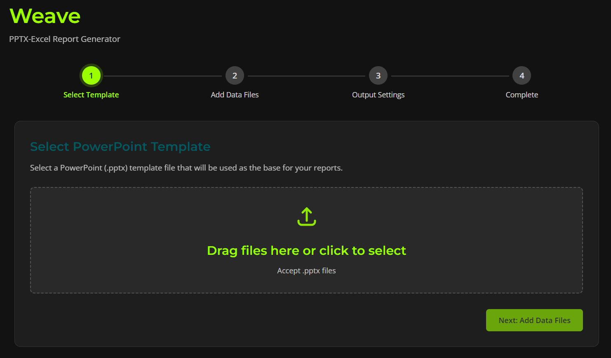
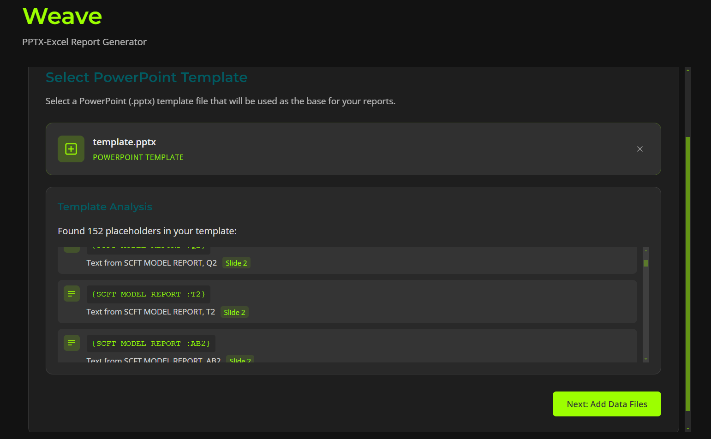
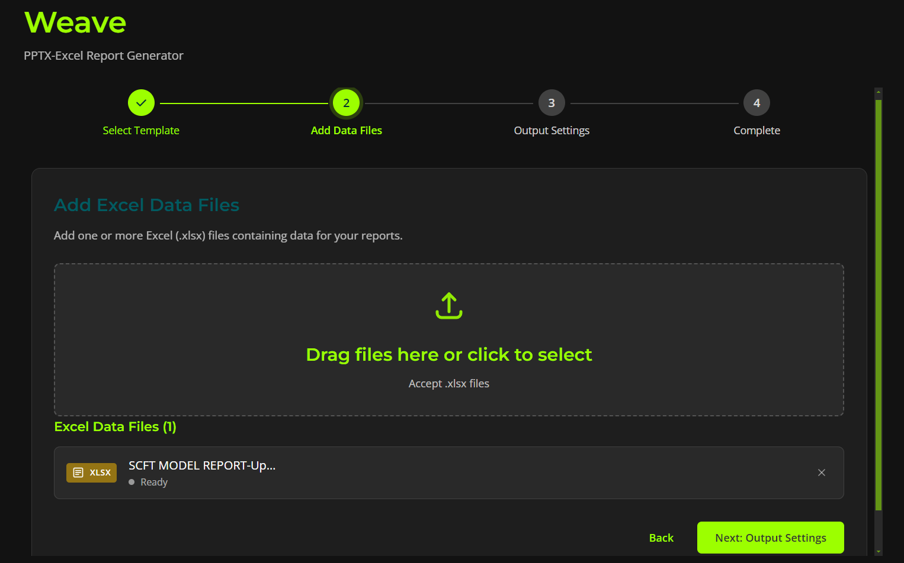
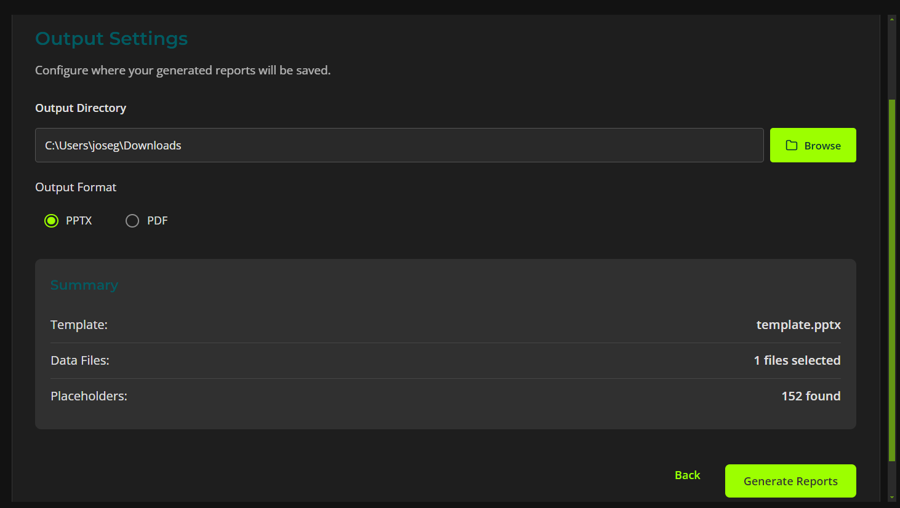
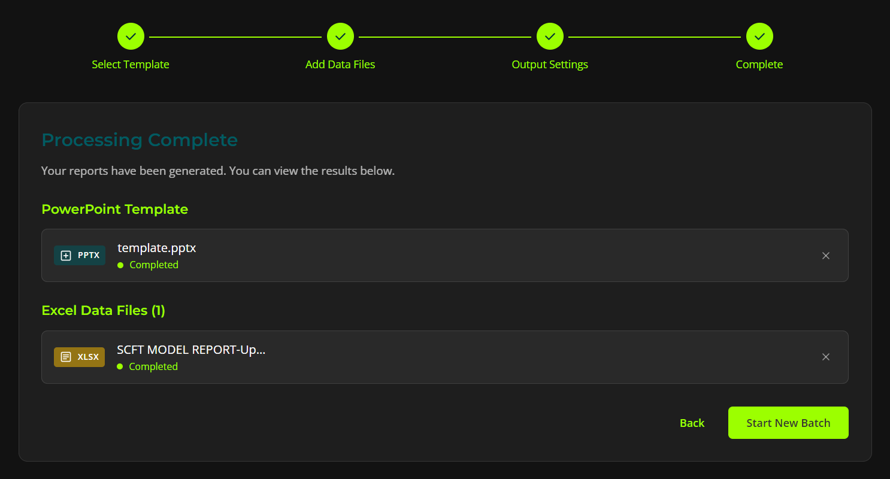

# Weave

Weave is a powerful tool that streamlines the creation of PowerPoint presentations by dynamically weaving data from Excel files into your presentation templates. This application is designed for anyone who needs to generate customized reports, summaries, or presentations on a regular basis, saving you time and effort.

## Key Features

-   **Template-based Generation**: Create stunning presentations by defining templates with placeholders for your data.
-   **Excel Integration**: Seamlessly pull data from your Excel spreadsheets to populate your presentations.
-   **Dynamic Content**: Weave supports both text and image replacement, allowing for rich and dynamic content.
-   **User-friendly Interface**: A clean and intuitive interface makes it easy to manage your templates, data, and generate presentations.
-   **Cross-platform**: Built with Electron, Weave works on Windows, macOS, and Linux.

## How it Works

Weave uses a simple yet powerful placeholder syntax to identify where your data should be inserted into your PowerPoint template. The placeholders are in the format `{SheetName:CellReference}` for text and `{SheetName:IMG}` for images.

When you provide a PowerPoint template and an Excel file, Weave reads the data from the specified sheet and cell in your Excel file and replaces the corresponding placeholder in your presentation. This allows you to quickly generate multiple presentations with different data, all based on the same template.

## Architectural Evolution

Weave began as a standalone desktop application, with the backend and frontend bundled into a single installer using PyInstaller. The goal was to provide a simple, all-in-one tool for a specific client. However, as the project's potential grew, the limitations of this approach became clear.

The project is now built on a more robust and scalable **client-server architecture**. This migration was driven by several key factors:

1.  **Scalability and Wider Reach:** The initial bundled approach was a bottleneck. A server-based model allows us to serve multiple users and clients without requiring them to install a complex, bundled application.

2.  **Leveraging Powerful Server-Side Tools:** The migration was critically fueled by the need to use powerful, open-source tools like **LibreOffice** for document conversions. This frees the project from dependencies on closed-source software (like Microsoft PowerPoint automation) and provides more flexible processing capabilities.

3.  **Enabling Advanced Features:** A server backend is the perfect foundation for building more sophisticated features, such as an in-app template editor, user account management for billing, and a centralized job processing queue.

The new architecture consists of two main parts:

*   **Frontend Client**: A lightweight desktop application (built with Electron and React) that provides the user interface. It is responsible for user interaction, file selection, and communicating with the server.
*   **Backend Server**: A powerful Python server (using Flask) that exposes a REST API. It handles all the heavy lifting:
    *   Authenticating users for metered billing via JWTs.
    *   Receiving uploaded files.
    *   Performing document conversions.
    *   Weaving data from Excel into PowerPoint templates.
    *   Serving the final, generated presentation back to the client.

This decoupled architecture provides a clear separation of concerns and enhances security by centralizing all business logic.

## Technology Stack

Weave is built with a modern technology stack to ensure a robust and reliable experience:

-   **Frontend**: React with TypeScript.
-   **Desktop Shell**: Electron.
-   **Backend**: A Python server using the Flask framework.
-   **Document Processing**:
    -   **`python-pptx`**: For creating and manipulating PowerPoint files.
    -   **`openpyxl`**: For reading data from Excel files.
    -   **`LibreOffice`**: Planned for robust, open-source document conversions.

## Screenshots

<div style="display: flex; flex-wrap: wrap; justify-content: space-around;">
  <div style="flex: 0 0 45%; margin: 10px; text-align: center;">
    <h3>Opening Page</h3>
    
  </div>
  <div style="flex: 0 0 45%; margin: 10px; text-align: center;">
    <h3>Template Uploaded</h3>
    
  </div>
  <div style="flex: 0 0 45%; margin: 10px; text-align: center;">
    <h3>Excel Uploaded</h3>
    
  </div>
  <div style="flex: 0 0 45%; margin: 10px; text-align: center;">
    <h3>Output Settings</h3>
    
  </div>
  <div style="flex: 0 0 45%; margin: 10px; text-align: center;">
    <h3>Completed Page</h3>
    
  </div>
</div>

## Getting Started

To get started with Weave, follow these simple steps:

1.  **Installation**:
    ```bash
    npm install
    ```
2.  **Run Backend**:
    ```bash
    cd server
    pip install -r requirements.txt
    python app.py
    ```
3.  **Run Frontend**:
    ```bash
    npm run dev
    ```
4.  **Build**:
    ```bash
    npm run build
    ```
This will create a standalone installer for your operating system.

## Usage

1.  **Launch Weave**: Open the application to get started.
2.  **Select Your Template**: Choose the PowerPoint template you want to use.
3.  **Provide Your Data**: Select the Excel file containing the data you want to weave into your presentation.
4.  **Generate**: Click the "Generate" button to create your new presentation.

Weave will then process your files and generate a new PowerPoint presentation with your data woven in.